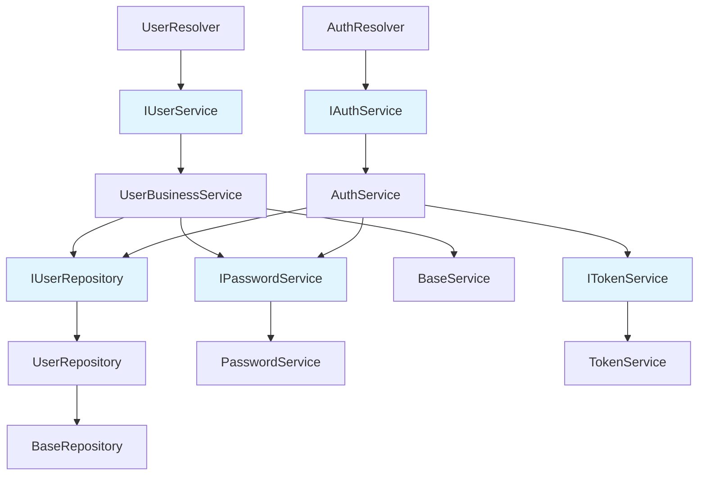

# SOLID Principles Implementation

This document explains how the SOLID principles have been implemented throughout the NestJS authentication application codebase.

## Overview

SOLID is an acronym for five design principles that help create maintainable, scalable, and robust software:

- **S**ingle Responsibility Principle (SRP)
- **O**pen/Closed Principle (OCP)
- **L**iskov Substitution Principle (LSP)
- **I**nterface Segregation Principle (ISP)
- **D**ependency Inversion Principle (DIP)

## 1. Single Responsibility Principle (SRP)

_"A class should have one, and only one, reason to change."_

### Implementation Examples

#### ✅ Password Service (`src/common/services/password.service.ts`)

```typescript
@Injectable()
export class PasswordService implements IPasswordService {
  // ONLY responsible for password operations:
  // - Hashing passwords
  // - Verifying passwords
  // - Generating passwords
  // - Validating password strength
}
```

#### ✅ Token Service (`src/common/services/token.service.ts`)

```typescript
@Injectable()
export class TokenService implements ITokenService {
  // ONLY responsible for JWT token operations:
  // - Generating access/refresh tokens
  // - Verifying tokens
  // - Extracting data from tokens
  // - Checking token expiration
}
```

#### ✅ User Repository (`src/user/repositories/user.repository.ts`)

```typescript
@Injectable()
export class UserRepository implements IUserRepository {
  // ONLY responsible for user data persistence:
  // - CRUD operations for users
  // - Database queries
  // - Data retrieval and storage
}
```

#### ✅ User Business Service (`src/user/services/user-business.service.ts`)

```typescript
@Injectable()
export class UserBusinessService implements IUserService {
  // ONLY responsible for user business logic:
  // - Business rule validation
  // - Data transformation
  // - Coordinating between repositories and other services
}
```

### Benefits Achieved

- Each class has a single, well-defined purpose
- Changes to password logic don't affect token logic
- Database operations are isolated from business logic
- Easier testing and maintenance

---

## 2. Open/Closed Principle (OCP)

_"Software entities should be open for extension, but closed for modification."_

### Implementation Examples

#### ✅ Base Repository (`src/common/abstracts/base-repository.abstract.ts`)

```typescript
export abstract class BaseRepository<T extends Document> {
  // Core CRUD operations - CLOSED for modification
  async create(createDto: Partial<T>): Promise<HydratedDocument<T>> { ... }
  async findById(id: string): Promise<HydratedDocument<T> | null> { ... }
  // ... other base methods
}

// User Repository EXTENDS base functionality - OPEN for extension
export class UserRepository extends BaseRepository<User> {
  // Additional user-specific methods without modifying base
  async findByEmail(email: string): Promise<HydratedDocument<User> | null> { ... }
  async findByProviderId(provider: string, providerId: string): Promise<...> { ... }
}
```

#### ✅ Base Service (`src/common/abstracts/base-service.abstract.ts`)

```typescript
export abstract class BaseService<T extends Document> {
  // Core business operations - CLOSED for modification
  async create(createDto: Partial<T>): Promise<HydratedDocument<T>> { ... }

  // Template method hooks - OPEN for extension
  protected abstract getEntityName(): string;
  protected async validateBeforeCreate(createDto: Partial<T>): Promise<void> { ... }
  protected async afterCreate(entity: HydratedDocument<T>): Promise<void> { ... }
}
```

#### ✅ Interface Extensions

```typescript
// Core interface - CLOSED for modification
export interface IUserRepository {
  create(createUserInput: CreateUserInput): Promise<HydratedDocument<User>>;
  findById(id: string): Promise<HydratedDocument<User> | null>;
}

// Extended interfaces - OPEN for extension
export interface IAuthService {
  register(registerInput: RegisterInput): Promise<AuthResponse>;
  login(loginInput: LoginInput): Promise<AuthResponse>;
}

export interface IOAuthService {
  googleLogin(user: any): Promise<AuthResponse>;
  githubLogin(user: any): Promise<AuthResponse>;
}
```

### Benefits Achieved

- New functionality can be added without modifying existing code
- Base classes provide common functionality
- Template method pattern allows customization points
- Reduced risk of breaking existing functionality

---

## 3. Liskov Substitution Principle (LSP)

_"Objects of a superclass should be replaceable with objects of a subclass without breaking the application."_

### Implementation Examples

#### ✅ Interface Substitutability

```typescript
// Any class implementing IUserService can be substituted
class UserBusinessService implements IUserService { ... }
class UserCacheService implements IUserService { ... }
class UserMockService implements IUserService { ... }

// All can be used interchangeably:
constructor(private readonly userService: IUserService) {}
```

#### ✅ Repository Substitutability

```typescript
// Any class implementing IUserRepository can be substituted
class UserRepository implements IUserRepository { ... }
class UserMemoryRepository implements IUserRepository { ... }
class UserCacheRepository implements IUserRepository { ... }

// Dependency injection allows substitution:
constructor(private readonly userRepository: IUserRepository) {}
```

#### ✅ Service Substitutability

```typescript
// Different password service implementations
class PasswordService implements IPasswordService { ... }
class BCryptPasswordService implements IPasswordService { ... }
class SCryptPasswordService implements IPasswordService { ... }

// All maintain the same contract:
constructor(private readonly passwordService: IPasswordService) {}
```

### Benefits Achieved

- Interface contracts are maintained across implementations
- Easy to swap implementations for testing or different environments
- Polymorphism works correctly throughout the application
- Mock objects can replace real services seamlessly

---

## 4. Interface Segregation Principle (ISP)

_"Many client-specific interfaces are better than one general-purpose interface."_

### Implementation Examples

#### ✅ Segregated Authentication Interfaces

```typescript
// Focused interfaces instead of one large interface

export interface IPasswordService {
  hashPassword(password: string): Promise<string>;
  verifyPassword(password: string, hash: string): Promise<boolean>;
  validatePasswordStrength(password: string): boolean;
}

export interface ITokenService {
  generateAccessToken(payload: any): string;
  generateRefreshToken(payload: any): string;
  verifyToken(token: string): any;
}

export interface IOAuthService {
  googleLogin(user: any): Promise<AuthResponse>;
  githubLogin(user: any): Promise<AuthResponse>;
}

export interface ISessionService {
  createSession(userId: string, metadata?: any): Promise<string>;
  getSession(sessionId: string): Promise<any>;
  deleteSession(sessionId: string): Promise<boolean>;
}
```

#### ✅ Segregated User Interfaces

```typescript
// Repository interface - only data operations
export interface IUserRepository {
  create(createUserInput: CreateUserInput): Promise<HydratedDocument<User>>;
  findById(id: string): Promise<HydratedDocument<User> | null>;
  findByEmail(email: string): Promise<HydratedDocument<User> | null>;
  // ... only data-related methods
}

// Service interface - only business operations
export interface IUserService {
  createUser(createUserInput: CreateUserInput): Promise<HydratedDocument<User>>;
  getUserProfile(id: string): Promise<HydratedDocument<User>>;
  updateUserProfile(
    id: string,
    updateUserInput: UpdateUserInput,
  ): Promise<HydratedDocument<User>>;
  // ... only business-related methods
}
```

### Benefits Achieved

- Classes only depend on methods they actually use
- Smaller, focused interfaces are easier to implement
- Changes to one interface don't affect unrelated clients
- Better testability with focused mock objects

---

## 5. Dependency Inversion Principle (DIP)

_"Depend on abstractions, not concretions."_

### Implementation Examples

#### ✅ High-Level Modules Depend on Abstractions

```typescript
@Injectable()
export class UserBusinessService implements IUserService {
  constructor(
    // Depends on abstraction (interface), not concrete class
    private readonly userRepository: IUserRepository,
    private readonly passwordService: IPasswordService,
  ) {}
}

@Injectable()
export class AuthService implements IAuthService {
  constructor(
    // Depends on abstractions, not concrete implementations
    private readonly userRepository: IUserRepository,
    private readonly passwordService: IPasswordService,
    private readonly tokenService: ITokenService,
  ) {}
}
```

#### ✅ Dependency Injection Configuration

```typescript
// In module configuration
@Module({
  providers: [
    // Interface binding to concrete implementation
    {
      provide: 'IUserRepository',
      useClass: UserRepository,
    },
    {
      provide: 'IPasswordService',
      useClass: PasswordService,
    },
    {
      provide: 'ITokenService',
      useClass: TokenService,
    },
    // High-level services depend on abstractions
    UserBusinessService,
    AuthService,
  ],
})
export class UserModule {}
```

#### ✅ Abstract Base Classes

```typescript
// High-level policy (BaseService) doesn't depend on low-level details
export abstract class BaseService<T extends Document> {
  constructor(
    // Depends on abstraction
    protected readonly repository: BaseRepository<T>,
    loggerContext: string,
  ) {}
}

// Low-level details depend on abstractions
export class UserRepository extends BaseRepository<User> {
  // Implementation details
}
```

### Benefits Achieved

- High-level modules are not coupled to low-level implementation details
- Easy to swap implementations without changing business logic
- Better testability with mock dependencies
- Flexible architecture that supports multiple implementations

---

## Architecture Diagram



## Testing Benefits

The SOLID implementation provides excellent testability:

### ✅ Mock Dependencies Easily

```typescript
describe('UserBusinessService', () => {
  let service: UserBusinessService;
  let mockUserRepository: jest.Mocked<IUserRepository>;
  let mockPasswordService: jest.Mocked<IPasswordService>;

  beforeEach(() => {
    mockUserRepository = createMock<IUserRepository>();
    mockPasswordService = createMock<IPasswordService>();

    service = new UserBusinessService(mockUserRepository, mockPasswordService);
  });
});
```

### ✅ Test Individual Responsibilities

```typescript
// Test only password operations
describe('PasswordService', () => {
  it('should hash password correctly', async () => {
    const result = await passwordService.hashPassword('plaintext');
    expect(result).toBeDefined();
    expect(result).not.toBe('plaintext');
  });
});

// Test only business logic
describe('UserBusinessService', () => {
  it('should validate email uniqueness', async () => {
    mockUserRepository.emailExists.mockResolvedValue(true);

    await expect(
      service.createUser({ email: 'test@example.com' }),
    ).rejects.toThrow('Email already exists');
  });
});
```

## Summary

This implementation demonstrates a comprehensive application of SOLID principles:

1. **SRP**: Each class has a single, well-defined responsibility
2. **OCP**: Base classes provide extensibility without modification
3. **LSP**: Interfaces ensure proper substitutability
4. **ISP**: Focused interfaces prevent unnecessary dependencies
5. **DIP**: High-level modules depend on abstractions

The result is a maintainable, testable, and scalable architecture that can easily adapt to changing requirements while minimizing the risk of introducing bugs.
